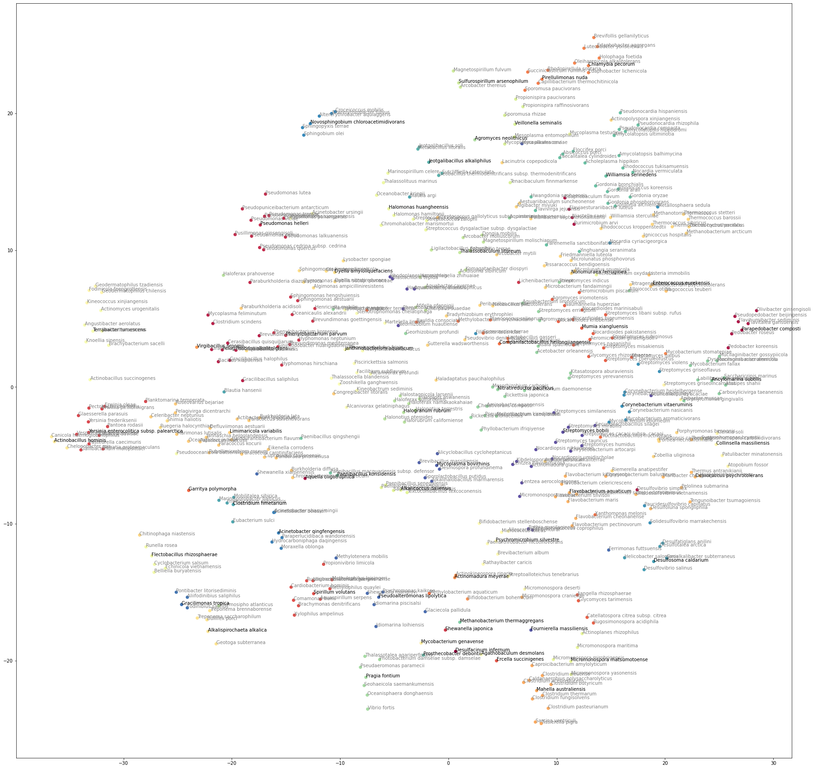

# geNLPtics

Playing with some FASTA data and learning about S16 for identification of various organisms. This repo uses data taked from [the Living Tree Project (LTP)](https://imedea.uib-csic.es/mmg/ltp/).

Data is read using a simple python function:

```python
def parse_fasta_dataset(
    file_path: str = "../data/LTP_09_2021_compressed.fasta.txt",
    max_seqs:int = False)
-> List[Dict[str, str]]:
    dataset = []
    current_idx = 0
    current_meta = {}
    with open(file_path, "r") as f:
        for line in f.readlines():
            if line[0] == ">":
                if current_meta != {}:
                    current_meta["sequence"] = current_meta["sequence"].strip()
                    dataset.append(current_meta)
                line_list = line.replace("\n", "").replace(">", "").split("\t")
                current_meta  = {key: line_list[idx] for idx, key in enumerate(["id", "name", "tags"])}
                current_meta["tags"] = current_meta["tags"].split(";")
                current_meta["sequence"] = ""
                current_idx += 1
                if current_idx > max_seqs and max_seqs>=1:
                    break
            else:
                current_meta["sequence"] += line.replace("\n", " ")
    return dataset

```

Which returns a data structure liike the following:

```json
{
  "id": "AB681979",
  "name": "Trabulsiella guamensis",
  "tags": [
    "Bacteria",
    "Proteobacteria",
    "Gammaproteobacteria",
    "Enterobacterales",
    "Enterobacteriaceae",
    "Trabulsiella"
  ],
  "sequence": "AUUGAACGCU..."
}
```

I then train a [gensim](https://radimrehurek.com/gensim/) [Doc2Vec](https://radimrehurek.com/gensim/models/doc2vec.html) model on the sequence data, treating the S16 sequence (I'm assuming thats what was in the file, BP length seems about right?) as a long _sentence_, having each base as a _word_. I am using the organism name as the tag for that document.

```python
model = gensim.models.Doc2Vec(
    documents=documents,
    workers=8,
    vector_size=64,
    negative=10,
    dm=1,
    hs=0,
    window=7,
    min_alpha=0.0001,
)
```

Using the document vectors I then run a clustering algorithm over it ([Affinity Propagation](https://scikit-learn.org/stable/modules/generated/sklearn.cluster.AffinityPropagation.html) from SKLearn). The chosen clustering algorithm has a notion of _central node_ for each cluster. This allows when plotting to show the most central node. Dimensionality reduction is performed using [t-SNE](https://scikit-learn.org/stable/modules/generated/sklearn.manifold.TSNE.html), which embeds the many dimensional embedding into lower dimensions using a manifold projection technique. Its unfortunately not deterministic, but is much better for displaying clustering in higher dimensions than [PCA/SVD](https://scikit-learn.org/stable/modules/generated/sklearn.decomposition.PCA.html). The Clusters are then plotted using [matplotlib](https://matplotlib.org/) as a basic scatter plot, with the 2d t-SNE embeddings and the clustering groups shown as colours, and the cluster centers with darker labels.

```python
from sklearn.decomposition import PCA
from sklearn.manifold import TSNE
from sklearn.cluster import AffinityPropagation
from matplotlib import pyplot as plt
import seaborn as sns

def plot_nodes(seq_ids: Dict[str, np.array], figsize=(50,50)):
    X = np.array([x for x in seq_ids.values()])

    # reduce dimensions to 2
    pca = TSNE(n_components=2, n_jobs=-1)
    result = pca.fit_transform(X)

    # do clustering on higher dimensions
    cluster = AffinityPropagation(random_state=42)
    cluster.fit(X)

    # plot as scatter
    plt.figure(figsize=figsize)
    plt.scatter(result[:, 0], result[:, 1], c=cluster.labels_, cmap=sns.color_palette("Spectral", as_cmap=True))
    for i, word in enumerate([x for x in seq_ids.keys()]):
        c = 'grey'
        if i in cluster.cluster_centers_indices_:
            c = 'black'
        plt.annotate(word, xy=(result[i, 0], result[i, 1]), c=c)
```

choosing a random 500 samples from the dataset and performing the dimensionality reduction/clustering results in the following plot:


